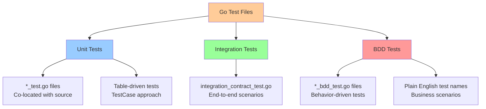
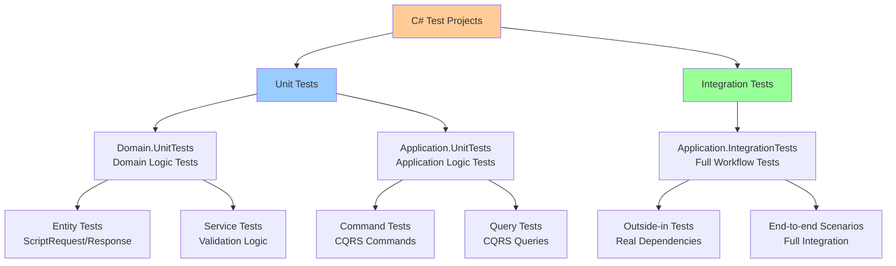
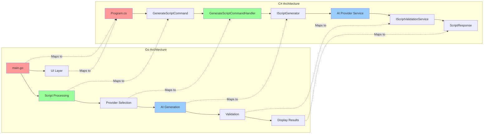

# Architecture Comparison: Go vs C# Implementation

## Go Architecture (Legacy Implementation)

```mermaid
graph TD
    A[main.go] --> B[UI Layer]
    A --> C[Core Logic]
    A --> D[Configuration]
    
    B --> B1[ui/interactive.go<br/>Menu System]
    B --> B2[ui/progress.go<br/>Progress Indicators]
    B --> B3[ui/colors.go<br/>Color Management]
    B --> B4[ui/banner.go<br/>Banner Display]
    B --> B5[ui/help.go<br/>Help System]
    
    C --> C1[script/<br/>Script Operations]
    C --> C2[providers/<br/>AI Providers]
    C --> C3[models/<br/>Selection Logic]
    
    C1 --> C1A[script/validation.go<br/>Risk Assessment]
    C1 --> C1B[script/operations.go<br/>Script Processing]
    C1 --> C1C[script/editor.go<br/>Script Editing]
    C1 --> C1D[script/refinement.go<br/>Script Improvement]
    
    C2 --> C2A[providers/openai.go<br/>OpenAI Integration]
    C2 --> C2B[providers/anthropic.go<br/>Anthropic Integration]
    C2 --> C2C[providers/ollama.go<br/>Ollama Integration]
    C2 --> C2D[providers/provider.go<br/>Common Interface]
    
    C3 --> C3A[models/selection.go<br/>Provider Selection]
    C3 --> C3B[models/ranking.go<br/>Provider Ranking]
    
    D --> D1[config/config.go<br/>Configuration Management]
    D --> D2[localization/<br/>Language Support]
    D --> D3[types/<br/>Type Definitions]
    
    D2 --> D2A[localization/manager.go<br/>Language Manager]
    D2 --> D2B[localization/loader.go<br/>Language Loading]
    D2 --> D2C[localization/defaults.go<br/>Default Languages]
    
    D3 --> D3A[types/types.go<br/>Core Types]
    D3 --> D3B[types/localization.go<br/>Localization Types]
    
    style A fill:#ff9999
    style B fill:#99ccff
    style C fill:#99ff99
    style D fill:#ffcc99
```

## C# Clean Architecture (New Implementation)

```mermaid
graph TD
    A[Presentation Layer] --> B[Application Layer]
    B --> C[Domain Layer]
    B --> D[Infrastructure Layer]
    
    A --> A1[Please.Console<br/>Console Application]
    A1 --> A1A[Program.cs<br/>Entry Point]
    
    B --> B1[Commands<br/>CQRS Commands]
    B --> B2[Queries<br/>CQRS Queries]
    B --> B3[DependencyInjection.cs<br/>Service Registration]
    
    B1 --> B1A[GenerateScript/<br/>Script Generation]
    B1 --> B1B[ValidateScript/<br/>Script Validation]
    B1 --> B1C[ExecuteScript/<br/>Script Execution]
    
    B2 --> B2A[GetLastScript/<br/>Script History]
    B2 --> B2B[GetProviderStatus/<br/>Provider Status]
    
    C --> C1[Entities<br/>Domain Models]
    C --> C2[Enums<br/>Value Objects]
    C --> C3[Interfaces<br/>Contracts]
    C --> C4[Services<br/>Domain Services]
    C --> C5[Exceptions<br/>Domain Errors]
    
    C1 --> C1A[ScriptRequest.cs<br/>Request Model]
    C1 --> C1B[ScriptResponse.cs<br/>Response Model]
    
    C2 --> C2A[ProviderType.cs<br/>AI Provider Types]
    C2 --> C2B[ScriptType.cs<br/>Script Types]
    C2 --> C2C[RiskLevel.cs<br/>Risk Assessment]
    
    C3 --> C3A[IScriptGenerator.cs<br/>AI Generation]
    C3 --> C3B[IScriptRepository.cs<br/>Data Access]
    
    C4 --> C4A[IScriptValidationService.cs<br/>Validation Logic]
    
    D --> D1[AI Providers<br/>External APIs]
    D --> D2[Repositories<br/>Data Storage]
    D --> D3[Services<br/>Infrastructure Services]
    D --> D4[Configuration<br/>Settings Management]
    
    D1 --> D1A[OpenAI Provider<br/>GPT Integration]
    D1 --> D1B[Anthropic Provider<br/>Claude Integration]
    D1 --> D1C[Ollama Provider<br/>Local Models]
    
    D2 --> D2A[Script Repository<br/>File Storage]
    D2 --> D2B[Configuration Repository<br/>Settings Storage]
    
    D3 --> D3A[Script Validation Service<br/>Risk Assessment]
    D3 --> D3B[Logging Service<br/>Observability]
    
    style A fill:#ff9999
    style B fill:#99ccff
    style C fill:#99ff99
    style D fill:#ffcc99
```

## Testing Architecture Comparison

### Go Testing Structure

### C# Testing Structure

## Migration Mapping

### Data Flow Transformation

## Key Architectural Differences

| Aspect | Go Implementation | C# Implementation |
|--------|-------------------|-------------------|
| **Structure** | Package-based, flat hierarchy | Layered Clean Architecture |
| **Dependency Management** | Direct imports, no DI container | Dependency Injection with IoC |
| **Error Handling** | Error return values | Exceptions with Result patterns |
| **Testing** | Co-located test files | Separate test projects |
| **Configuration** | Struct-based config | Options pattern with DI |
| **AI Provider Abstraction** | Interface with switch statements | Strategy pattern with DI |
| **Script Validation** | Function-based | Service-based with interfaces |
| **User Interface** | Direct console interaction | Command/Query separation |

## Benefits of C# Migration

### 1. **Clean Architecture Benefits**
- Clear separation of concerns
- Testable business logic
- Infrastructure independence
- Maintainable codebase

### 2. **Dependency Injection Benefits**
- Loose coupling between components
- Easy mocking and testing
- Configuration management
- Service lifetime management

### 3. **CQRS Benefits**
- Command/Query separation
- Clear request/response models
- Validation at boundaries
- Scalable architecture

### 4. **Testing Benefits**
- Outside-in testing approach
- Integration test capabilities
- Mockable dependencies
- Behavior-driven test naming

---

**Migration Status**: The C# implementation follows Clean Architecture principles with clear separation between Domain (business logic), Application (use cases), Infrastructure (external concerns), and Presentation (user interface) layers. The Go implementation will be gradually migrated to match this structure while preserving all existing functionality.
